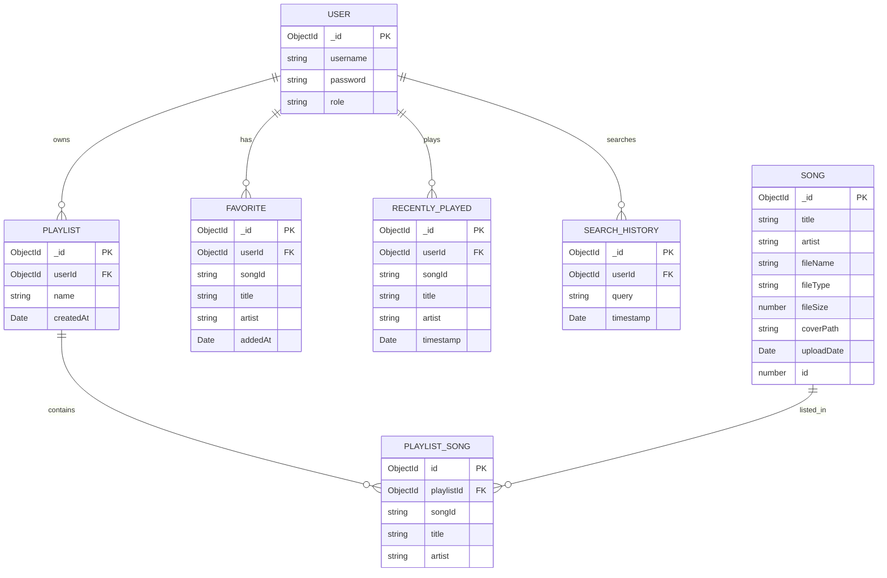

# Pro Music Player Black Book

## 1. Overview
- Full-stack music streaming app with admin library and user player.
- Stack: Node.js + Express + MongoDB + Mongoose + Vanilla JS.
- Files: frontend (index.html, admin.html, auth.html), backend (server.js), API client (js/*.js).
- Authentication: JWT via /auth/login and /auth/register.

## 2. Architecture
- Client: static HTML + CSS + JS (has local state in IndexedDB/localStorage, requests backend).
- Server: Express app with routes for songs, playlists, users, history, favorites.
- Storage: MongoDB collections: User, Song, Playlist, SearchHistory, RecentlyPlayed, Favorite.
- Media store: uploaded files in /uploads folder; streaming endpoint /stream/:songId.
- Cache: in-memory TTL for /songs endpoint (5 minutes) with invalidation on write.
- Deployment: Dockerfile + docker-compose (Mongo + app).

## 3. Data Model
### User
- username, password (hashed), role.

### Song
- title, artist, fileName, fileType, fileSize, coverPath, uploadDate, id (timestamp fallback).

### Playlist
- userId, name, songs [{songId, title, artist}], createdAt.

### Favorite/RecentlyPlayed/SearchHistory
- userId, songId, title, artist, timestamp.

## 4. API Spec
### Auth
- POST /auth/register {username,password} -> token
- POST /auth/login {username,password} -> token

### Songs
- GET /songs?page&limit -> {songs,total,page,totalPages}
- POST /songs (auth + multipart) -> create song
- POST /songs/batch (auth + multipart) -> batch create
- DELETE /songs/:id (auth) -> delete
- GET /stream/:songId -> audio range stream

### Playlists (auth)
- GET /playlists
- POST /playlists {name}
- POST /playlists/:id/songs {songId,title,artist}
- DELETE /playlists/:id/songs/:songId
- DELETE /playlists/:id

### Search/History/Favorites
- GET/POST/DELETE /history/search
- GET/POST /history/play
- GET/POST/DELETE /favorites

## 5. Frontend Workflows
### Player flow
- loadAllSongs() => /songs, enrich with src `${BACKEND_URL}/stream/${id}`
- displaySongs with play action playSongById
- playSong(song, userTriggered) handles browser autoplay restrictions
- progress update via timeupdate listener
- favorite toggle via /favorites (or localStorage fallback)
- search with local and server history; storage fallback
- playlist CRUD with robust id/_id handling and refresh from server

### Admin flow
- loadAdminSongs from /songs in admin panel
- uploadSong and uploadFolder with progress simulation
- deleteSong with cache refresh marker and detailed messages

## 6. Deployment & Run
- local: `npm install`, `node server.js`
- docker: `docker-compose up --build -d`
- ENV: `MONGODB_URI`, `PORT`, `JWT_SECRET`
- Visit `http://localhost:3000`, admin at `admin.html`, auth at `auth.html`.

## 7. Common problems + fixes
### 7.1 Autoplay blocked / Audio playback error #4
- playSong user-triggered by click; toast message instructs manual play.

### 7.2 "failed to fetch" on auth/upload
- use `BACKEND_URL` to avoid relative URL bugs.

### 7.3 playlist exists but not showing
- normalize playlist id/_id, reload playists after create/add/remove.

### 7.4 progress bar not filling
- CSS fixed `.progress-filled` selector.

## 8. Maintenance checklist
- Add unit tests (Jest/Supertest).
- Add integration tests for playlist/favorites.
- Add monitoring for cache hit ratio and stream performance.
- Secure uploads, add CORS/CSP and RBAC.

## 9. Screenshots
- `screenshots/player.png` : main player UI with song list and playback controls.
- `screenshots/admin.png` : admin library with upload form and song management.
- `screenshots/playlist.png` : playlist/queue view with add/remove actions.

> Note: Add these files to the repository assets and update these paths if necessary.

## 10. ER Diagram

## 11. Glossary
- BACKEND_URL: location origin fallback to localhost:3000.
- CACHE_TTL_MS: 300000 (5 min).
- allSongs: client track list.
- playlists: client playlist list.
- songs-updated-at: localStorage key for cross-tab sync.
